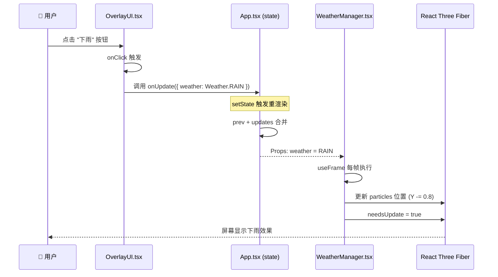
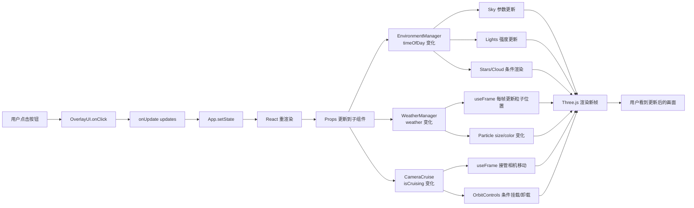

# 浮层交互到各模块的数据流说明文档

## 一、架构总览

整个系统采用 **React 单向数据流** 架构，使用 `App.tsx` 作为单一状态源（Single Source of Truth），通过 Props 将状态分发到各消费组件。

```
┌─────────────────────────────────────────────────────────────┐
│                        App.tsx                              │
│  ┌──────────────────────────────────────────────────────┐   │
│  │  FactoryState (useState)                             │   │
│  │  { weather, timeOfDay, isCruising, activeRobotId }   │   │
│  └─────────────────────┬────────────────────────────────┘   │
│                        │                                    │
│                        ▼                                    │
│    ┌─────────────────┐ ┌─────────────┐ ┌─────────────┐     │
│    │ EnvironmentMgr  │ │ WeatherMgr  │ │ CameraCruise│     │
│    │ (timeOfDay)     │ │ (weather)   │ │ (isCruising)│     │
│    └─────────────────┘ └─────────────┘ └─────────────┘     │
└─────────────────────────────────────────────────────────────┘
                             ▲
                             │
                      ┌──────────────┐
                      │  OverlayUI   │  ←── 用户点击
                      └──────────────┘
```

---

## 二、核心数据结构

### FactoryState 接口
**位置**：`types.ts:13-18`

```typescript
export interface FactoryState {
  weather: Weather;           // 天气状态：CLEAR / RAIN / SNOW
  timeOfDay: TimeOfDay;       // 昼夜：DAY / NIGHT
  isCruising: boolean;        // 自动巡航开关
  activeRobotId: string | null;
}
```

---

## 三、完整数据流（以切换天气为例）

### 数据流图（Mermaid）



---

## 四、分步详解

### 步骤 1：用户交互触发

**文件**：`components/OverlayUI.tsx:49-63`

```tsx
// 用户点击 "下雨" 按钮
<ControlBtn 
  active={state.weather === Weather.RAIN} 
  onClick={() => onUpdate({ weather: Weather.RAIN })}
  icon={<CloudRain size={18} className="text-blue-400" />} 
/>
```

**发生了什么**：
- 用户点击按钮触发 `onClick`
- 调用父组件传入的 `onUpdate` 回调
- 传入局部更新对象 `{ weather: Weather.RAIN }`

---

### 步骤 2：状态合并与更新

**文件**：`App.tsx:13-22`

```tsx
const [state, setState] = useState<FactoryState>({
  weather: Weather.CLEAR,
  timeOfDay: TimeOfDay.DAY,
  isCruising: false,
  activeRobotId: null,
});

const updateState = useCallback((updates: Partial<FactoryState>) => {
  setState(prev => ({ ...prev, ...updates }));  // 合并而不是替换
}, []);
```

**发生了什么**：
- `setState(prev => ({ ...prev, ...updates }))`
- 使用函数式更新 + 对象展开，**只覆盖变更字段**
- React 检测到状态变化，触发整棵子树重渲染

> **关键点**：使用 `Partial<FactoryState>` 允许只传需要更新的字段，避免覆盖其他状态。

---

### 步骤 3：Props 流向各消费组件

**文件**：`App.tsx:30-34`

```tsx
<EnvironmentManager timeOfDay={state.timeOfDay} />   // 只关心昼夜
<WeatherManager weather={state.weather} />           // 只关心天气
<CameraCruise enabled={state.isCruising} />          // 只关心巡航
```

**发生了什么**：
- React 将最新的 `state.weather` 传递给 `WeatherManager`
- 其他组件（如 `EnvironmentManager`）的 props 未变化，理论上可跳过重渲染
- 但由于父组件 `App` 重渲染，子组件默认都会重渲染（除非使用 `React.memo`）

---

### 步骤 4：消费组件响应状态变化

#### 4.1 WeatherManager 响应

**文件**：`components/WeatherManager.tsx:11-68`

```tsx
const WeatherManager: React.FC<WeatherManagerProps> = ({ weather }) => {
  // ...
  
  useFrame((state, delta) => {
    if (weather === Weather.CLEAR) return;  // CLEAR 时跳过
    
    const speed = weather === Weather.RAIN ? 0.8 : 0.2;
    // 每帧更新 2000 个粒子的位置
    for (let i = 0; i < count; i++) {
      positions[i * 3 + 1] -= speed;  // Y 轴下落
      if (weather === Weather.SNOW) {
        positions[i * 3] += Math.sin(...) * drift;  // 雪花飘动
      }
    }
    meshRef.current.geometry.attributes.position.needsUpdate = true;
  });

  if (weather === Weather.CLEAR) return null;  // 直接不渲染粒子
  // ...
};
```

**响应逻辑**：
| weather 值 | 行为 |
|---|---|
| `CLEAR` | `return null`，不渲染任何粒子 |
| `RAIN` | 粒子速度 0.8，尺寸 0.1，蓝色 |
| `SNOW` | 粒子速度 0.2，尺寸 0.2，白色 + X 轴飘动 |

---

#### 4.2 EnvironmentManager 响应

**文件**：`components/EnvironmentManager.tsx:12-49`

```tsx
const EnvironmentManager: React.FC<EnvironmentManagerProps> = ({ timeOfDay }) => {
  const isNight = timeOfDay === TimeOfDay.NIGHT;
  const sunPos: [number, number, number] = isNight ? [0, -10, -10] : [10, 10, 10];
  
  return (
    <>
      <Sky sunPosition={sunPos} inclination={isNight ? 0.6 : 0} />
      {isNight && <Stars ... />}                   {/* 夜晚显示星星 */}
      {!isNight && <Cloud ... />}                  {/* 白天显示云 */}
      
      <ambientLight intensity={isNight ? 0.1 : 0.4} />
      <directionalLight intensity={isNight ? 0.2 : 1.2} ... />
      
      <pointLight intensity={isNight ? 0.8 : 0.2} />  {/* 室内灯 */}
      {/* 夜晚额外开启两个装饰灯 */}
      <pointLight intensity={isNight ? 0.5 : 0} color="#63b3ed" />
      <pointLight intensity={isNight ? 0.5 : 0} color="#ed8936" />
    </>
  );
};
```

**响应逻辑**：

| 元素 | DAY | NIGHT |
|---|---|---|
| 太阳位置 | `[10, 10, 10]` | `[0, -10, -10]` |
| 天空倾角 | 0 | 0.6 |
| 星星 | ❌ 不渲染 | ✅ 渲染 5000 颗 |
| 云朵 | ✅ 渲染 | ❌ 不渲染 |
| 环境光强度 | 0.4 | 0.1 |
| 平行光强度 | 1.2 | 0.2 |
| 主室内灯 | 0.2 | 0.8 |
| 装饰灯（蓝） | 0（关闭） | 0.5（开启） |
| 装饰灯（橙） | 0（关闭） | 0.5（开启） |

---

#### 4.3 CameraCruise 响应

**文件**：`components/CameraCruise.tsx:11-38`

```tsx
const CameraCruise: React.FC<CameraCruiseProps> = ({ enabled }) => {
  const { camera } = useThree();
  
  useFrame((state, delta) => {
    if (!enabled) return;  // 巡航关闭时直接返回
    
    // 向目标点插值移动
    camera.position.lerp(targetPos.current, delta * 0.5);
    camera.lookAt(lookAtPos.current);
    
    // 到达后切换到下一个航点
    if (camera.position.distanceTo(targetPos.current) < 1) {
      const nextIdx = (waypointIndex + 1) % CAMERA_PATH.length;
      // 更新目标位置...
    }
  });

  return null;  // 不渲染任何 Three.js 对象
};
```

**响应逻辑**：
- `enabled = false`：`useFrame` 每帧 early return，相机控制权交给 `OrbitControls`
- `enabled = true`：接管相机，按 `CAMERA_PATH` 航点依次巡航

同时在 `App.tsx:36-43`：
```tsx
{!state.isCruising && (
  <OrbitControls makeDefault ... />   // 巡航时卸载 OrbitControls
)}
```
> 这是一个条件渲染切换：巡航开启时，手动控制器被卸载。

---

## 五、三种交互的完整数据链路对照表

| 用户操作 | 调用 onUpdate 参数 | 影响组件 | 组件行为 |
|---|---|---|---|
| 点击 "白天" | `{ timeOfDay: TimeOfDay.DAY }` | EnvironmentManager | 太阳升起、隐藏星星、减弱室内灯 |
| 点击 "夜晚" | `{ timeOfDay: TimeOfDay.NIGHT }` | EnvironmentManager | 太阳落下、显示星星、点亮室内装饰灯 |
| 点击 "晴天" | `{ weather: Weather.CLEAR }` | WeatherManager | 不渲染粒子系统 |
| 点击 "下雨" | `{ weather: Weather.RAIN }` | WeatherManager | 2000 个蓝色粒子快速下落 |
| 点击 "下雪" | `{ weather: Weather.SNOW }` | WeatherManager | 2000 个白色粒子缓慢下落 + 飘动 |
| 切换 "自动巡航" | `{ isCruising: true/false }` | CameraCruise + OrbitControls | 接管相机按航点移动 / 卸载巡航，恢复手动控制 |

---

## 六、设计亮点与技术要点

### 1. 单一状态源
所有交互状态集中在 `App.tsx` 的 `FactoryState` 中，避免了状态分散管理的复杂性。

### 2. Props 单向绑定
各消费组件只通过 Props 接收数据，不直接修改状态，符合 React 单向数据流原则。

### 3. 按帧响应（useFrame）
- `WeatherManager` 和 `CameraCruise` 都使用 `@react-three/fiber` 的 `useFrame` hook
- 每帧检查当前状态值，而不是依赖事件回调
- 这种模式适合需要连续动画的场景

### 4. 条件渲染控制
- `WeatherManager` 在 `CLEAR` 时 `return null`，直接卸载粒子系统
- `OrbitControls` 在巡航时被条件卸载，避免控制冲突

### 5. 状态合并策略
使用 `setState(prev => ({ ...prev, ...updates }))` 确保只覆盖变更字段，保护其他状态不丢失。

---

## 七、状态变更时序图（综合版）


